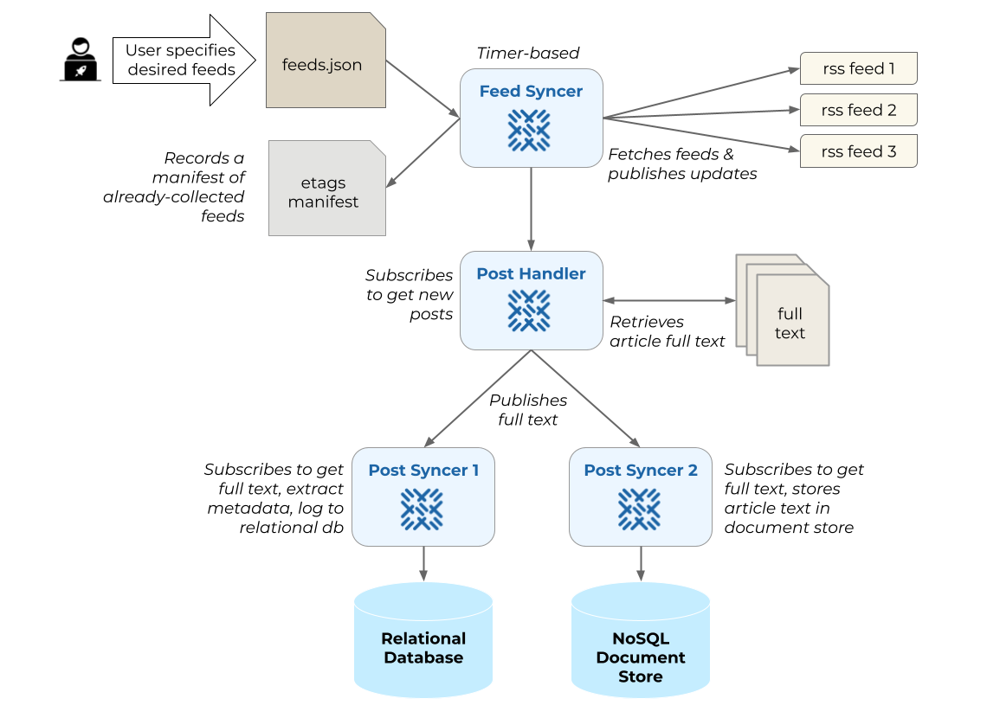

# Baleen

**An automated ingestion service of RSS feeds to construct a corpus for NLP research.**

[](https://godoc.org/github.com/kansaslabs/baleen)
[](https://goreportcard.com/report/github.com/kansaslabs/baleen)
[](https://github.com/rotationalio/baleen/actions/workflows/test.yaml)

[](fixtures/baleen_diagram.png)

## Getting Started

Baleen is currently running in the `baleen` namespace of the `rotational-gke-usa-1` cluster as a Kubernetes deployment. It connects to [Production Ensign](https://rotational.app) and operates on feeds that it receives from the subscriptions channel. In order to interact with Baleen topics, first get Ensign API Keys from the team that is running the Baleen deployment.

Once you've aquired the keys, in your current working directory, copy `.env.template` to `.env` and populate the following environment variables:

1. `$BALEEN_PUBLISHER_ENSIGN_CLIENT_ID`
2. `$BALEEN_PUBLISHER_ENSIGN_CLIENT_SECRET`
3. `$BALEEN_SUBSCRIBER_ENSIGN_CLIENT_ID`
4. `$BALEEN_SUBSCRIBER_ENSIGN_CLIENT_SECRET`

Alternatively if you prefer, you can simply populate `$ENSIGN_CLIENT_ID` and `$ENSIGN_CLIENT_SECRET` to use for both the publisher and the subscribers.

Now install the `baleen` CLI program:

```
$ go install github.com/rotationalio/baleen/cmd/baleen@ensign-demo
```

Make sure it is installed with `baleen -h` you should see at least three subcommands: `feeds:add`, `posts:add`, and `debug`.

To add feeds for Baleen to process, collect your RSS Feeds in OPML format (either XML or JSON, see [fixtures/feedly.opml](fixtures/feedly.opml) and [fixtures/feedly.json](fixtures/feedly.json) for templates. Then publish the RSS feeds events:

```
$ baleen feeds:add -o path/to/my.opml
```

To process a single post:

```
$ baleen posts:add https://example.com/blog/example-post.html
```

Finally to listen for Baleen events to debug what's going on:

```
$ baleen debug
```

## Topics

These are the topics that Baleen currently uses:

1. `subscriptions`: each event is an RSS feed that Baleen will start to regularly sync.
2. `feeds`: each event is a FeedItem from an RSS feed whose post needs to be fetched.
3. `documents`: each event is the full HTML from a url fetched by Baleen.

## Notes

- [Google I/O 2013 - Advanced Go Concurrency Patterns](https://www.youtube.com/watch?v=QDDwwePbDtw)

### Design specification

- Golang ingestion system that fetches RSS feeds and stores raw data into S3 or a database for archive and analytics.
- Web-based RSS feed management system that will allow us to easily manage sources
- Focus on fetching full text by following links in the RSS feed
- Feed data quality measurements with language statistics, e.g. words, vocab, etc. rate of corpus growth, number of entities, etc. (we should look at prose for this)
- JSON based logging with limited retention so we don’t fill up our server with logs - tracking of aggregate metrics over time so we know what’s going on and if it's working.
- Produce model based translations for sentences and paragraphs from the source language to target languages; crowdsource feedback by creating an app that allows bilingual users to say if a translation is good or not to establish annotations.
- Annotation quality assessment tools and gamification.